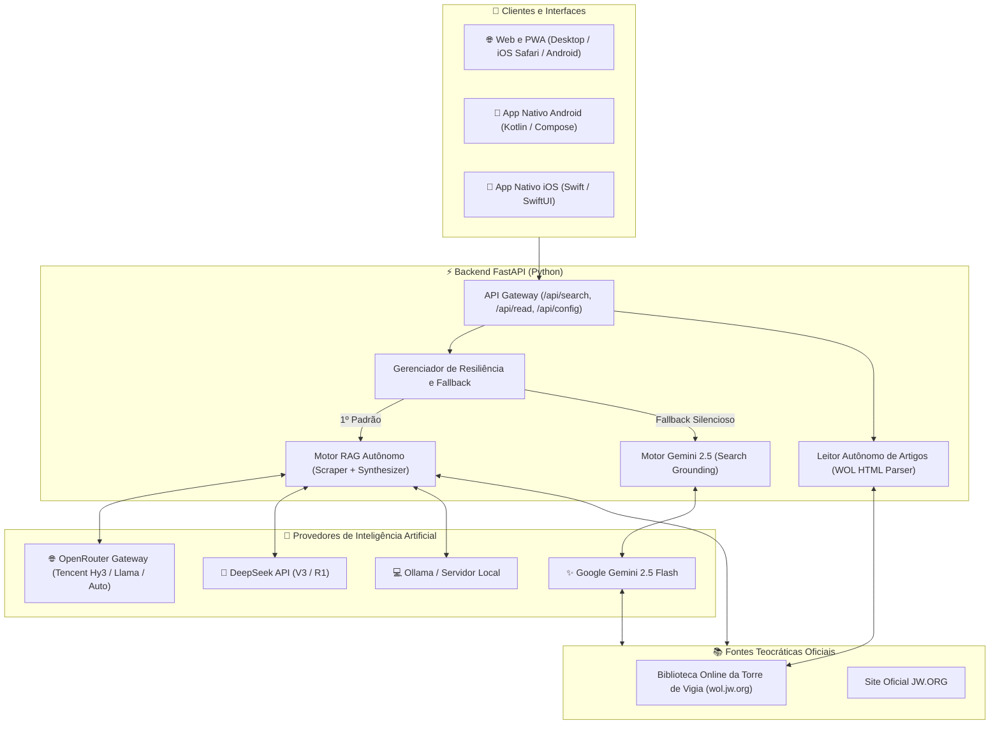

# 📖 JW Search - Portal & Aplicativo de Pesquisa Teocrática Inteligente

O **JW Search** é uma plataforma multiplataforma de pesquisa teocrática avançada alimentada por **Inteligência Artificial Híbrida e RAG Autônomo (Retrieval-Augmented Generation)**. A aplicação realiza consultas profundas e estruturadas exclusivamente no acervo oficial das Testemunhas de Jeová (**[wol.jw.org](https://wol.jw.org)** e **[jw.org](https://www.jw.org)**), oferecendo respostas sintetizadas com links Markdown clicáveis para os artigos oficiais e leitor integrado.

---

## 🏛️ Arquitetura Geral do Sistema



---

## 🚀 Motores de Inteligência Artificial & Estratégia Multi-Modelo

O sistema foi arquitetado para ser **100% resiliente a limites de cota** através de uma abordagem híbrida:

| Motor | Provedor Principal | Tecnologia | Função no Sistema |
| :--- | :--- | :--- | :--- |
| ⚡ **Hy3 / OpenAI (Padrão)** | OpenRouter / Tencent | **RAG Próprio + WOL Scraper** | Motor primário padrão. Coleta artigos em tempo real no WOL e sintetiza via modelo `tencent/hy3`. |
| ✨ **Google Gemini 2.5** | Google AI Studio | **Search Grounding Nativo** | Motor secundário e contingência automática. Se a cota do Hy3 atingir o limite, o Gemini assume instantaneamente. |
| 🧠 **DeepSeek RAG** | DeepSeek | **RAG Próprio + DeepSeek V3/R1** | Motor especializado para raciocínio analítico profundo e estudos temáticos complexos. |

### 🔄 Cadeia de Resiliência Automática:
1. O usuário faz a pesquisa ➡️ O backend processa prioritariamente no **Hy3 / OpenRouter**.
2. Se a cota do servidor ou a chave do Hy3 retornar erro/limite ➡️ O servidor aciona silenciosamente o **Google Gemini 2.5 Flash**.
3. Se **ambas as cotas padrão do servidor esgotarem** ➡️ O sistema exibe um modal convidando o usuário a inserir sua própria chave gratuita no navegador (sem custo para quem hospeda o servidor).

---

## 💬 Agente Conversacional Interativo & Geração de Documentos

O **JW Search** funciona como um agente de pesquisa contínua e interativa (estilo **Perplexity AI**), com suporte a histórico contextual acumulado e geração de múltiplos formatos:

- 📊 **Tabelas Comparativas:** Geração e renderização de tabelas completas em Markdown com bordas e cabeçalhos nítidos.
- 👨‍👩‍👧‍👦 **Roteiros & Esboços Teocráticos:** Elaboração de resumos práticos para estudo pessoal e em família.
- 📄 **Exportação em 4 Formatos:**
  - **Markdown (`.md`):** Exportação rápida e completa com textos bíblicos e links do WOL.
  - **Sessão JSON (`.json`):** Backup completo do estudo com metadados para restaurar no futuro.
  - **Word (`.docx`):** Documento formal diagramado para edição no Microsoft Word e Google Docs.
  - **PDF (`.pdf`):** Layout otimizado para impressão e leitura offline.
- 📥 **Importação & Continuidade de Estudos:** Permite carregar arquivos `.json` ou `.md` de estudos anteriores e continuar conversando de onde parou.
- 🛡️ **Guarda de Saída / Confirmação ao Fechar:** Diálogo inteligente que pergunta se você deseja exportar ou salvar seu estudo no histórico local antes de iniciar uma nova busca.

---

## 🛠️ Tecnologias e Plataformas Utilizadas

### 1. 🌐 Frontend & Web App (PWA)
- **HTML5 & Vanilla JavaScript (ES6+ Moderno):** Arquitetura conversacional leve e de alta performance, sem frameworks pesados de compilação no cliente.
- **Tailwind CSS (JIT via CDN):** Interface moderna, responsiva, com suporte a tabelas responsivas e layout de impressão.
- **FontAwesome 6 Pro & Google Fonts (Inter):** Tipografia e iconografia refinada.
- **Progressive Web App (PWA):** `manifest.json` e Service Worker (`sw.js`) para instalação em tela cheia no iOS (Safari) e Android, com suporte a cache.
- **Leitor Lateral de Artigos (Drawer):** Renderização direta do artigo do WOL sem anúncios ou distrações.

### 2. ⚡ Backend & APIs (Python)
- **FastAPI:** Framework web assíncrono com endpoints de busca simples (`/api/search`), chat contínuo (`/api/chat`) e exportação de documentos (`/api/export/docx`).
- **Python-Docx:** Motor autônomo de conversão de Markdown e tabelas para arquivos `.docx` do Word.
- **BeautifulSoup4 & Urllib:** Extração e higienização precisa do DOM de artigos, notas de estudo e referências bíblicas da Biblioteca Online.
- **OpenAI Python SDK:** Comunicação padronizada com gateways (OpenRouter, DeepSeek, Tencent, Ollama).
- **Google GenAI SDK:** Integração oficial de última geração com o Gemini 2.5 Flash e ferramentas de Grounding.
- **Pillow (PIL):** Script autônomo (`backend/generate_icons.py`) para geração vetorial e rasterização com supersampling 4x dos ícones oficiais.

### 3. 🤖 Aplicativo Mobile Android
- **Linguagem:** Kotlin 2.0+.
- **Interface:** Jetpack Compose + Material Design 3.
- **Arquitetura:** MVVM (Model-View-ViewModel) com Coroutines, StateFlow e Flow reativo.
- **Interação:** Reconhecimento de tecla Enter no teclado virtual (`ImeAction.Search`), TopAppBar com retorno à Home ao tocar no logo, e ícones dedicados em todas as densidades mipmap (`mdpi`, `hdpi`, `xhdpi`, `xxhdpi`, `xxxhdpi`).
- **Artefato Gerado:** `JW-Search.apk` pronto para distribuição direta sem necessidade de Play Store.

### 4. 🍏 Aplicativo Mobile iOS
- **Método 1 (PWA Nativo Safari):** Instalação em 1 clique via "Adicionar à Tela de Início" funcionando em tela cheia idêntico a um app da App Store.
- **Método 2 (App Nativo Swift):** Código-fonte nativo em SwiftUI pronto para compilação no Xcode e instalação via Sideloading (.ipa).

---

## ☁️ Hospedagem em Nuvem Gratuita & UptimeRobot (24/7 Sem Suspender)

O projeto está totalmente configurado para rodar na nuvem gratuita do **Render**:

### 🤖 Por que usar o UptimeRobot?
O plano gratuito do Render desliga os containers (*spin down / sleep mode*) após 15 minutos de inatividade, fazendo com que o primeiro acesso demore cerca de 50 segundos para acordar o servidor.

Para resolver isso e manter o **JW Search 100% ativo 24/7 com resposta instantânea**:

1. Crie uma conta gratuita no [UptimeRobot](https://uptimerobot.com/).
2. Clique em **"+ Add New Monitor"**.
3. Preencha:
   - **Monitor Type:** `HTTP(s)`
   - **Friendly Name:** `JW Search Cloud Server`
   - **URL (or IP):** `https://seu-servico.onrender.com/api/config`
   - **Monitoring Interval:** `5 minutes` (a cada 5 minutos)
4. Salve o monitor. O UptimeRobot fará uma requisição leve a cada 5 minutos, mantendo seu container sempre quente e disponível!

---

## 🔑 Variáveis de Ambiente do Servidor (Render ou `.env`)

Para disponibilizar o serviço já configurado para os usuários:

| Variável | Descrição | Onde Obter |
| :--- | :--- | :--- |
| `HY3_API_KEY` | Chave de API do OpenRouter ou Tencent | [OpenRouter Keys](https://openrouter.ai/keys) *(Grátis)* |
| `OPENAI_API_KEY` | Chave compatível com OpenAI/OpenRouter | [OpenRouter Keys](https://openrouter.ai/keys) |
| `GEMINI_API_KEY` | Chave de API do Google Gemini | [Google AI Studio](https://aistudio.google.com/) *(Grátis)* |
| `DEEPSEEK_API_KEY` | Chave de API do DeepSeek | [DeepSeek Platform](https://platform.deepseek.com/) |

---

## 🚀 Como Executar o Projeto

### 💻 1. No Computador (Windows / Local):
1. Dê um duplo clique no arquivo **`start.bat`**.
2. O script instalará as dependências do Python se necessário e abrirá o navegador em **`http://localhost:8000`**.

### 📱 2. No Celular Android:
1. Transfira o arquivo **`JW-Search.apk`** (na raiz do repositório) para o seu celular.
2. Toque nele e confirme a instalação.

### 🍏 3. No iPhone ou iPad (iOS):
1. Abra o link do seu site no **Safari**.
2. Toque no botão de **Compartilhar** ➡️ **Adicionar à Tela de Início**.
3. O app abrirá em tela cheia com ícone oficial.

---

## 🧪 Testes Automatizados

O backend possui uma suíte de testes unitários e de integração contínua (`backend/test_api_keys.py`):
- Verificação de autenticação de cada provedor (Gemini, DeepSeek, Hy3).
- Validação do scraper do motor RAG Teocrático no acervo do `wol.jw.org`.
- Validação do leitor autônomo offline `/api/read`.
- Validação da cadeia de resiliência e fallbacks.

Para executar os testes:
```bash
python backend/test_api_keys.py
```

---

## 📂 Estrutura de Diretórios do Repositório

```text
├── JW-Search.apk               # Aplicativo compilado pronto para Android
├── JW-Search-Completo.zip      # Pacote zip para distribuição offline
├── start.bat                   # Inicializador automático para Windows
├── README.md                   # Documentação mestre do projeto
│
├── backend/                    # Servidor e Motores de IA (FastAPI)
│   ├── main.py                 # Roteador de endpoints e cadeia de fallback
│   ├── rag_engine.py           # Motor RAG teocrático e síntese de contexto
│   ├── scraper.py              # Motor Gemini Grounding e Leitor WOL
│   ├── generate_icons.py       # Gerador de ícones multiplataforma
│   ├── test_api_keys.py        # Suíte de testes automatizados
│   └── requirements.txt        # Dependências Python
│
├── web/                        # Frontend Web & Progressive Web App
│   ├── index.html              # Interface do usuário com modal multi-abas
│   ├── app.js                  # Lógica do cliente, gerenciamento de chaves e busca
│   ├── manifest.json           # Manifesto PWA para instalação mobile
│   ├── sw.js                   # Service Worker para cache offline
│   ├── favicon.ico             # Ícone do navegador
│   └── icons/                  # Ícones em alta resolução para PWA e iOS
│
├── android/                    # Código-Fonte do Aplicativo Nativo Android
│   ├── app/src/main/java/      # Telas e ViewModels em Jetpack Compose
│   └── app/src/main/res/       # Layouts, mipmaps e recursos de ícone
│
└── ios/                        # Código-Fonte do Aplicativo Nativo iOS
    └── JWSearch/               # Projeto nativo em Swift e SwiftUI
```

---

## 📄 Licença e Uso

Este projeto foi desenvolvido para fins de estudo, pesquisa e uso pessoal no estudo da Bíblia e das publicações oficiais das Testemunhas de Jeová disponíveis publicamente em **wol.jw.org** e **jw.org**.
