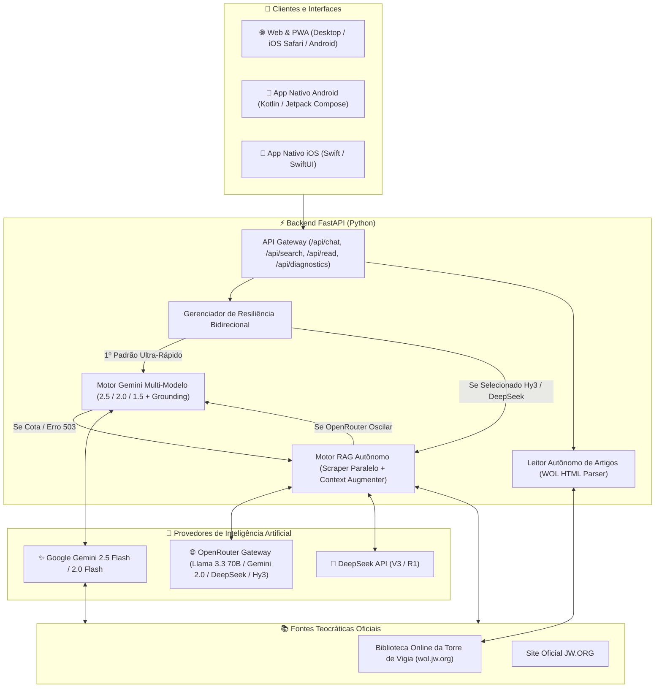

# 📖 JW Search - Portal & Aplicativo de Pesquisa Teocrática Inteligente

O **JW Search** é uma plataforma multiplataforma de pesquisa teocrática avançada alimentada por **Inteligência Artificial Híbrida e RAG Autônomo (Retrieval-Augmented Generation)**. A aplicação realiza consultas profundas e estruturadas exclusivamente no acervo oficial das Testemunhas de Jeová (**[wol.jw.org](https://wol.jw.org)** e **[jw.org](https://www.jw.org)**), oferecendo respostas sintetizadas com links Markdown clicáveis para os artigos oficiais, leitor integrado, painel de diagnósticos em tempo real e exportação multi-formato.

---

## 🏛️ Arquitetura Geral do Sistema



---

## 🚀 Motores de Inteligência Artificial & Resiliência Bidirecional

O sistema foi arquitetado para ser **100% autônomo e resiliente a limites de cota ou indisponibilidade**:

| Motor | Provedor | Tecnologia | Função no Sistema |
| :--- | :--- | :--- | :--- |
| ✨ **Google Gemini 2.5 (Padrão)** | Google AI Studio | **Search Grounding Nativo + Multi-Modelo** | Motor primário ultra-rápido (4 a 8 segundos). Realiza busca ao vivo e síntese teocrática profunda. |
| ⚡ **Hy3 / OpenRouter (RAG Próprio)** | OpenRouter / Tencent | **RAG Autônomo + Scraping Paralelo** | Motor RAG próprio independente. Coleta artigos em tempo real no `wol.jw.org`, injeta o texto completo e sintetiza via Llama 3.3 70B, DeepSeek ou Hy3. |
| 🧠 **DeepSeek RAG** | DeepSeek Platform | **RAG Autônomo + DeepSeek V3/R1** | Motor analítico focado em estudos exegéticos e tópicos de pesquisa complexos. |

### 🔄 Como Funciona a Resiliência Bidirecional:
1. **Se o Google Gemini esgotar a cota ou tiver um pico de demanda (503):** ➡️ O **Motor RAG Autônomo** entra em ação automaticamente, extrai os artigos do WOL e sintetiza a resposta completa.
2. **Se o modelo do OpenRouter/Hy3 estiver com fila pública longa ou retornar vazio:** ➡️ O servidor tenta a cadeia de modelos livres (`meta-llama/llama-3.3-70b-instruct:free`, `google/gemini-2.0-flash-exp:free`, `deepseek/deepseek-chat`) ou aciona silenciosamente o **Google Gemini**.
3. **Se todas as chaves do servidor esgotarem:** ➡️ O usuário recebe uma notificação simples para inserir sua própria chave gratuita no painel de configurações (sem custo para quem hospeda).

---

## 💬 Agente Conversacional Interativo & Geração de Documentos

O **JW Search** opera no padrão de pesquisa contínua e interativa (**estilo Perplexity AI**):

- 📌 **Ponderação Teocrática Completa:**
  - **Resposta Direta & Síntese:** Resumo objetivo com fundamentação bíblica.
  - **Análise Teocrática Detalhada:** Explanação com citações nominais de publicações (*A Sentinela*, *Despertai!*, *Estudo Perspicaz*, *Histórias da Bíblia*) e links Markdown diretos.
  - **Textos Bíblicos Principais:** Versículos com links para a Tradução do Novo Mundo da Bíblia.
  - **Publicações e Fontes Oficiais:** Lista de referências recomendadas para aprofundamento.
- 📊 **Tabelas Comparativas:** Geração instantânea de tabelas completas em Markdown com bordas, alinhamento e síntese comparativa.
- 📝 **Esboços Estruturados:** Roteiros com algarismos romanos, títulos e subtítulos para estudo.
- 👨‍👩‍👧‍👦 **Estudo em Família:** Resumos em tópicos práticos com perguntas de reflexão para pais e filhos.
- 📄 **Exportação em 4 Formatos:**
  - **Markdown (`.md`):** Ideal para editores de texto como Obsidian, Notion e VS Code.
  - **Sessão JSON (`.json`):** Backup integral da conversa com metadados para restauração futura.
  - **Word (`.docx`):** Documento diagramado e formatado para edição no Microsoft Word e Google Docs.
  - **PDF (`.pdf`):** Layout limpo otimizado para impressão e leitura offline.
- 📥 **Importação de Estudos Anteriores:** Permite carregar conversas salvas em `.json` ou `.md` e continuar pesquisando de onde parou.
- 🛡️ **Confirmação ao Fechar (Guarda de Saída):** Janela de proteção que questiona se você deseja salvar ou exportar o estudo antes de fechar a aba ou iniciar um novo tema.

---

## ⚡ Painel de Diagnóstico & Latência em Tempo Real

Diretamente no cabeçalho da interface, o botão **"⚡ Diagnóstico"** permite inspecionar a saúde de toda a infraestrutura em tempo real:

- ⚡ **Latência do Servidor Cloud (Render Ping):** Tempo de resposta HTTP em milissegundos.
- 📚 **Biblioteca WOL (wol.jw.org):** Velocidade de busca e extração de artigos em tempo real.
- ✨ **Google Gemini 2.5 Flash:** Status de prontidão da chave e conectividade com a API.
- 🧠 **Hy3 / OpenRouter / DeepSeek:** Status das credenciais e da cadeia de contingência.
- ⏱️ **Medidor de Latência nas Mensagens:** Selo em cada card informando o tempo exato decorrido (ex: `⏱️ 5.4s • Gemini 2.5 Flash`).

---

## 🛠️ Tecnologias e Plataformas Utilizadas

### 1. 🌐 Frontend & Web App (PWA)
- **HTML5 & Vanilla JavaScript (ES6+ Moderno):** Arquitetura conversacional rápida e reativa sem dependências pesadas de compilação.
- **Tailwind CSS (JIT via CDN):** Design limpo, tipografia legível, suporte completo a tabelas responsivas e estilos de impressão.
- **FontAwesome 6 Pro & Google Fonts (Inter):** Iconografia oficial e tipografia moderna.
- **Progressive Web App (PWA):** `manifest.json` e Service Worker (`sw.js`) para instalação em 1 clique no iOS (Safari) e Android.
- **Leitor Lateral de Artigos (Drawer):** Leitor sem distrações com tipografia ampliada para ler os artigos do WOL sem sair da conversa.

### 2. ⚡ Backend & APIs (Python)
- **FastAPI:** Framework web assíncrono de alto desempenho (`/api/chat`, `/api/search`, `/api/read`, `/api/diagnostics`, `/api/export/docx`).
- **Python-Docx:** Motor autônomo de geração e diagramação de arquivos `.docx` para o Word.
- **BeautifulSoup4 & ThreadPoolExecutor:** Extração de conteúdo e scraping paralelo de artigos teocráticos com cache em memória.
- **OpenAI Python SDK:** Comunicação padronizada com gateways (OpenRouter, DeepSeek, Tencent, Ollama).
- **Google GenAI SDK:** Integração com o Gemini 2.5 Flash, 2.0 Flash e Search Grounding.
- **Pillow (PIL):** Script autônomo (`backend/generate_icons.py`) com supersampling 4x para geração dos ícones oficiais.

### 3. 🤖 Aplicativo Mobile Android
- **Linguagem:** Kotlin 2.0+.
- **Interface:** Jetpack Compose + Material Design 3.
- **Arquitetura:** MVVM (Model-View-ViewModel) com Coroutines e StateFlow.
- **Artefato Gerado:** `JW-Search.apk` pronto para instalação direta sem necessidade de loja de aplicativos.

### 4. 🍏 Aplicativo Mobile iOS
- **Método 1 (PWA Safari):** Instalação nativa via "Adicionar à Tela de Início" no Safari, funcionando em tela cheia com ícone dedicado.
- **Método 2 (App Nativo Swift):** Código-fonte nativo em SwiftUI pronto para compilação no Xcode.

---

## ☁️ Hospedagem em Nuvem Gratuita & UptimeRobot (24/7 Sem Suspender)

O projeto está configurado para hospedagem gratuita no **Render**:

### 🤖 Monitoramento com UptimeRobot
O plano gratuito do Render desliga os containers (*spin down / sleep mode*) após 15 minutos sem requisições, gerando um atraso no primeiro acesso (*cold start*).

Para manter o **JW Search 100% ativo 24 horas por dia com resposta instantânea**:

1. Crie uma conta gratuita no [UptimeRobot](https://uptimerobot.com/).
2. Clique em **"+ Add New Monitor"**.
3. Preencha os campos:
   - **Monitor Type:** `HTTP(s)`
   - **Friendly Name:** `JW Search Cloud Server`
   - **URL (or IP):** `https://seu-servico.onrender.com/api/config`
   - **Monitoring Interval:** `5 minutes` (a cada 5 minutos)
4. Salve o monitor. O UptimeRobot enviará uma requisição leve a cada 5 minutos, mantendo seu servidor sempre ativo e aquecido.

---

## 🔑 Variáveis de Ambiente do Servidor (Render ou `.env`)

| Variável | Descrição | Onde Obter |
| :--- | :--- | :--- |
| `GEMINI_API_KEY` | Chave da API do Google Gemini (Motor Padrão) | [Google AI Studio](https://aistudio.google.com/) *(Grátis)* |
| `HY3_API_KEY` | Chave da API do OpenRouter ou Tencent | [OpenRouter Keys](https://openrouter.ai/keys) *(Grátis)* |
| `OPENAI_API_KEY` | Chave compatível com OpenAI/OpenRouter | [OpenRouter Keys](https://openrouter.ai/keys) |
| `DEEPSEEK_API_KEY` | Chave da API do DeepSeek | [DeepSeek Platform](https://platform.deepseek.com/) |

---

## 🚀 Como Executar o Projeto

### 💻 1. No Computador (Windows / Local):
1. Dê um duplo clique no arquivo **`start.bat`**.
2. O script instalará as dependências do Python automaticamente se necessário e abrirá o navegador em **`http://localhost:8000`**.

### 📱 2. No Celular Android:
1. Transfira o arquivo **`JW-Search.apk`** para o seu celular.
2. Toque nele e confirme a instalação.

### 🍏 3. No iPhone ou iPad (iOS):
1. Abra o link do seu site no **Safari**.
2. Toque no botão de **Compartilhar** ➡️ **Adicionar à Tela de Início**.
3. O app abrirá em tela cheia com ícone oficial.

---

## 🧪 Testes Automatizados

O backend possui uma suíte de testes unitários e de integração contínua (`backend/test_api_keys.py`):
- Verificação de autenticação de cada provedor (Gemini, DeepSeek, Hy3).
- Validação do scraper do motor RAG Teocrático no acervo do `wol.jw.org`.
- Validação do leitor autônomo offline `/api/read`.
- Validação da exportação de documentos Word `/api/export/docx`.
- Validação do endpoint de diagnóstico `/api/diagnostics`.
- Validação da cadeia de resiliência e fallbacks bidirecionais.

Para executar os testes:
```bash
python backend/test_api_keys.py
```

---

## 📂 Estrutura de Diretórios do Repositório

```text
├── JW-Search.apk               # Aplicativo compilado pronto para Android
├── JW-Search-Completo.zip      # Pacote zip para distribuição offline
├── start.bat                   # Inicializador automático para Windows
├── README.md                   # Documentação mestre completa do projeto
│
├── backend/                    # Servidor e Motores de IA (FastAPI)
│   ├── main.py                 # Roteador de endpoints, diagnóstico e fallbacks
│   ├── rag_engine.py           # Motor RAG teocrático, busca WOL e scraping paralelo
│   ├── scraper.py              # Motor Gemini Grounding multi-modelo e leitor WOL
│   ├── generate_icons.py       # Gerador de ícones multiplataforma
│   ├── test_api_keys.py        # Suíte de testes automatizados (8 testes)
│   └── requirements.txt        # Dependências Python
│
├── web/                        # Frontend Web & Progressive Web App
│   ├── index.html              # Interface do usuário com modal de diagnósticos
│   ├── app.js                  # Lógica do cliente, gerenciamento de chaves e chat
│   ├── manifest.json           # Manifesto PWA para instalação mobile
│   ├── sw.js                   # Service Worker para cache offline
│   ├── favicon.ico             # Ícone do navegador
│   └── icons/                  # Ícones em alta resolução para PWA e iOS
│
├── android/                    # Código-Fonte do Aplicativo Nativo Android
│   ├── app/src/main/java/      # Telas e ViewModels em Jetpack Compose
│   └── app/src/main/res/       # Layouts, mipmaps e recursos de ícone
│
└── ios/                        # Código-Fonte do Aplicativo Nativo iOS
    └── JWSearch/               # Projeto nativo em Swift e SwiftUI
```

---

## 📄 Licença e Uso

Este projeto foi desenvolvido para fins de estudo, pesquisa e uso pessoal no estudo da Bíblia e das publicações oficiais das Testemunhas de Jeová disponíveis publicamente em **wol.jw.org** e **jw.org**.
