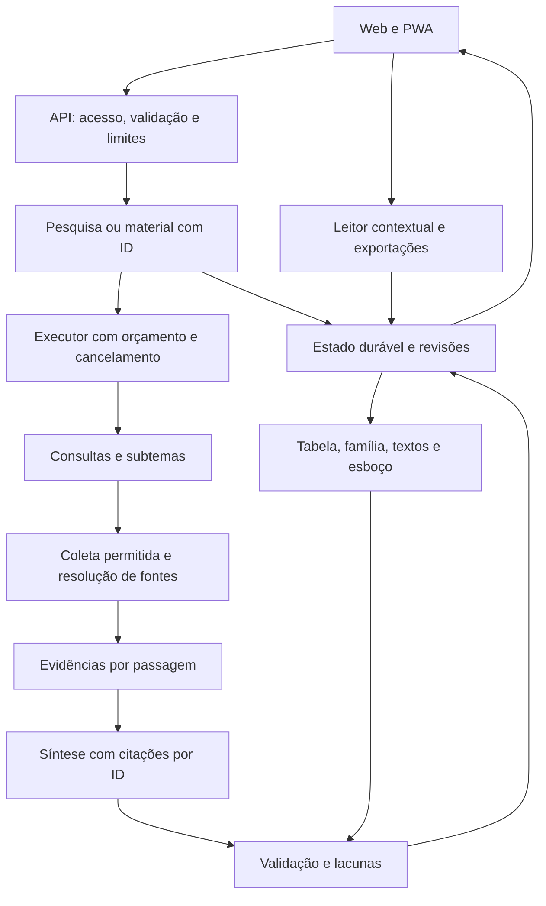

# Arquitetura proposta e decisões técnicas

Documento de planejamento. Os nomes de módulos e endpoints abaixo descrevem a evolução desejada; ainda não existem no repositório.

## 1. Decisão principal

Evoluir o sistema como **aplicação modular com FastAPI, web/PWA e um executor de pesquisas**, compartilhando contratos de fontes e materiais. Não há evidência que justifique começar com microserviços, múltiplos agentes ou reescrita do frontend em outro framework.

A prioridade arquitetural é ter uma representação de pesquisa verificável que todas as ferramentas possam reutilizar. Esse núcleo evita quatro implementações independentes de pesquisa e citações.



## 2. Componentes e responsabilidades

| Componente | Responsabilidade | Não deve fazer |
|---|---|---|
| Rotas/API | Validar entrada, identidade/posse, orçamento e contrato | Aceitar URL de provedor livre com chave do servidor |
| Orquestrador | Controlar etapas, tentativas, cancelamento e progresso | Criar novas tentativas sem prazo/custo restante |
| Planejador | Entender tema atual e decompor subperguntas | Transformar pedido de tabela em nova pesquisa genérica |
| Recuperador | Buscar documentos permitidos com consultas úteis | Tratar bloqueio antibot como página lida |
| Resolver/extrator | URL canônica, título real, publicação, parágrafos | Trocar artigo silenciosamente porque título parece diferente |
| Registro de evidências | Relacionar afirmações a passagens e versões | Confundir URL gerada com fonte consultada |
| Adaptadores de provedores | Capacidades, erro tipado, tokens e modelo usado | Misturar configuração ou credencial de outro provedor |
| Geradores de materiais | Transformar evidências em estrutura solicitada | Fazer pesquisa adicional sem registrar nova proveniência |
| Validador | Integridade dos IDs, literalidade, metadados e limites | Declarar certeza teológica por percentual automático |
| Leitor/renderizador | Exibir conteúdo seguro e navegar por fonte | Executar HTML remoto ou inventar metadados |
| Exportador | Produzir o mesmo conteúdo estruturado em formatos diferentes | Reinterpretar toda a pesquisa a partir de Markdown frágil |

Estrutura sugerida: `api/`, `schemas/`, `research/`, `sources/`, `providers/`, `artifacts/`, `storage/`, `exports/`, `observability/` e `tests/`. A separação pode começar em poucos arquivos; criar pasta vazia não é objetivo de entrega.

No frontend, separar estado/conversas, cliente API, apresentação do estudo, leitor, ferramentas, armazenamento e exportações. Aplicar módulos e assets versionados gradualmente, preservando a experiência atual.

## 3. Modelo de dados

| Entidade | Campos essenciais |
|---|---|
| Study | id, owner/session, título, idioma, revisão ativa, datas |
| ResearchRun | id, study_id, parent_revision, pergunta, modo, escopo, estado, orçamento, versões de prompt/pipeline, uso real |
| ResearchRevision | id, run_id, conteúdo estruturado, resumo, data, fontes/trechos/afirmações, lacunas |
| Source | id, domínio, canonical_url, título original, publicação, edição/data quando disponíveis, tipo |
| SourceSnapshot | id, source_id, idioma/edição, acessado_em, hash, status de obtenção e metadados |
| Passage | id, snapshot_id, localização, trecho/contexto necessário, referência bíblica quando aplicável |
| Claim | id, revisão/material, texto, tipo: afirmação documental ou inferência, estado de suporte |
| Citation | claim_id, passage_id, locator, relação de suporte |
| Artifact | id, owner, tipo, research_revision_id, parâmetros, versão ativa |
| ArtifactRevision | id, artifact_id, conteúdo tipado, citações, autoria/edições, tempos, data |
| Job | id, resource_id, estado, deadline, checkpoint, lease, eventos e idempotency_key |

Título original e título de apresentação são separados. Não corrigir nomes automaticamente com substituições como `Fe → Fé`. URLs de busca/remissão e URL final não são a mesma identidade. Parágrafos diferentes do mesmo documento continuam distinguíveis, embora o documento seja deduplicado.

Texto integral de uma fonte não precisa ser retido indefinidamente. Guardar metadados, hashes e passagens necessárias conforme política definida; o leitor pode consultar a origem. Conteúdo privado e histórico não entram em cache público. Atualizar a fonte gera snapshot novo e não reescreve um material antigo sem aviso.

## 4. Contratos das ferramentas

Um pedido derivado informa:

```json
{
  "research_revision_id": "rev_...",
  "type": "talk_outline",
  "selected_passage_ids": ["p_..."],
  "options": {
    "duration_seconds": 1800,
    "style": "outline",
    "locked_sections": []
  }
}
```

Tabela: linhas/colunas/células como dados, com passage_ids. Família: objetivo, perfis selecionados, agenda, perguntas, alternativas, atividades e fontes. Textos: lista de passagens usadas/complementares, relação e proveniência. Discurso: blocos com tempos, objetivo, pontos, leituras, aplicações, transições e fontes.

A resposta de material precisa indicar `complete`, `partial`, `needs_input` ou `failed`, além de avisos estruturados quando não houver fonte suficiente ou quando a duração solicitada não comportar conteúdo obrigatório.

Uma edição humana é permitida e deve ser preservada. Se modificar uma afirmação com citação, a citação não continua automaticamente marcada como validada. Regeneração ou reverificação atua na nova revisão.

## 5. API e compatibilidade

Sugestão de versão nova:

| Operação | Finalidade |
|---|---|
| POST `/api/v2/research` | Inicia pesquisa e retorna ID/estado |
| GET `/api/v2/research/{id}` | Obtém estado e resultado autorizado |
| GET `/api/v2/research/{id}/events` | Acompanha progresso; polling autenticado é alternativa |
| POST `/api/v2/research/{id}/cancel` | Solicita cancelamento idempotente |
| POST `/api/v2/artifacts` | Cria material da revisão escolhida |
| GET `/api/v2/artifacts/{id}` | Lê versões autorizadas |
| POST `/api/v2/artifacts/{id}/revisions` | Salva edição ou nova versão |
| GET `/api/v2/sources/{id}/passages/{passage_id}` | Abre trecho autorizado/conhecido no leitor |
| POST `/api/v2/export` | Exporta recurso/revisão/formato, com escopo explícito |
| GET `/healthz` | Saúde leve do serviço, sem consulta cara ao acervo |

Respostas de erro incluem `code`, mensagem apropriada, request_id e indicação de retry quando cabível; não incluem segredo, stack trace ou URL com credencial.

Manter `/api/chat` e `/api/search` como adaptadores durante a transição. `ai_response/results` podem ser derivados do contrato novo para clientes antigos, com depreciação documentada. Não fingir que cliente antigo oferece todas as ferramentas novas.

Histórico/JSON recebe `schema_version`. Na migração, estudos antigos são preservados como legado, sem promover suas citações a verificadas. A exportação antiga permanece importável. Importação de Markdown conserva conteúdo como anotação/texto, não como prova de leitura de fontes.

## 6. Fluxo de pesquisa e expansão

1. Normalizar intenção/idioma sem alterar a pergunta original.
2. Selecionar consultas por subtema; reutilizar passagens já disponíveis.
3. Buscar e classificar resultados; resolver índices/remissões úteis.
4. Ler passagens relevantes e contexto, sem se limitar ao início da página.
5. Registrar cobertura e lacunas: subpergunta, evidências existentes e motivo para nova busca.
6. Expandir referências com valor demonstrável, controlando documentos visitados, redundância, profundidade e orçamento.
7. Gerar síntese com IDs de fontes/trechos existentes.
8. Validar e corrigir/rejeitar citações inválidas dentro do orçamento; se não der, finalizar parcial.
9. Salvar revisão e metadados para as ferramentas.

Não é necessário adotar banco vetorial inicialmente. Consulta focada, normalização, resolução canônica e seleção lexical de passagens são uma primeira base mensurável. Considerar índice híbrido somente depois do benchmark demonstrar ganho.

No Gemini, aproveitar metadados de grounding para associar segmentos e fontes e cumprir os requisitos de apresentação aplicáveis ao recurso. O projeto atual coleta links, mas não preserva essa associação de suporte. Grounding continua sujeito à verificação do documento e do escopo. [Documentação do Google](https://ai.google.dev/gemini-api/docs/google-search).

## 7. Execução, fila e timeout

Usar deadline global, não uma soma ilimitada de timeouts individuais. Antes de cada operação, calcular tempo restante. Timeout de conexão/leitura precisa ser compatível com esse restante, e leitura muito lenta não deve permitir operação interminável.

Perfis experimentais iniciais: até 60–75 segundos para sintetizada e até 180 segundos para aprofundada, incluindo a definição explícita de como tempo em fila é tratado. Esses valores não são SLA nem promessa: devem ser calibrados por medição e pela hospedagem escolhida. O frontend recebe os limites do servidor e acompanha o recurso; não mantém um corte fixo independente de 90 segundos.

Uma alternativa por provedor é um ponto de partida mais controlável que tentar cinco ou seis modelos. Não repetir erro permanente de autenticação/modelo inexistente; backoff para falha temporária respeita deadline. Preço/capacidade da alternativa devem estar na política: “fallback” não autoriza gasto ilimitado.

Criar tarefa não significa obrigatoriamente instalar Redis/Celery. Para escala inicial, pode-se usar banco relacional com jobs, leases e executor separado, desde que claim/locking sejam atômicos e testados. Em hospedagem que reinicia/apaga disco local, SQLite efêmero e fila só em memória não satisfazem a promessa de retomada. A escolha final depende de volume, retenção e orçamento ainda não medidos.

O FastAPI permite tarefas após a resposta, mas isso não fornece por si só armazenamento durável, autorização, retry seguro nem recuperação de worker. Sua documentação distingue tarefas simples e processamento maior. [Documentação do FastAPI](https://fastapi.tiangolo.com/tutorial/background-tasks/).

### Estados

`queued → running → succeeded | partial | failed | cancelled | expired`

Fases internas: planning, retrieving, reading, expanding, generating, validating e rendering. Cancellation_requested é um sinal; não afirmar `cancelled` enquanto o sistema ainda inicia operações. Ao expirar, encerrar novas tentativas e preservar um resultado parcial válido se houver.

Idempotência evita duplicação na API. A chamada a um provedor já enviada pode ter sido cobrada mesmo que o worker reinicie antes de registrar a resposta; não prometer exatamente uma cobrança. Registrar tentativa, checkpoints e limites de retomada para reduzir duplicação.

Streaming pode entregar eventos de progresso e seções já verificadas. Exibir tokens crus antes da validação precisa de estado claramente provisório; a recomendação inicial é progresso real e publicação de seções validadas. “Primeiro evento” não é métrica equivalente a “primeira resposta útil”.

## 8. Segurança e privacidade

- Credenciais associadas a destinos cadastrados; nenhuma combinação de URL arbitrária com segredo do servidor.
- Política de rede compartilhada pelos conectores: protocolo/host/porta, validação de IP e de redirects, limites de tamanho/tempo, nenhum acesso interno implícito. A prevenção precisa considerar redirects e resolução DNS, não só uma regex de URL. [Orientações OWASP](https://cheatsheetseries.owasp.org/cheatsheets/Server_Side_Request_Forgery_Prevention_Cheat_Sheet.html).
- Leitor de fonte oficial e carregamento de assets são políticas distintas. Imagens podem vir de CDNs oficiais explicitamente cadastradas; isso não habilita esses hosts como fontes textuais de pesquisa indiscriminadamente.
- Sanitização por allowlist e DOM seguro; validar imports, esquemas de URL e atributos. Testar também manipulações depois da sanitização.
- Identidade local/sessão opaca no beta ou autenticação na hospedagem pública; verificar posse em pesquisa, material, evento, cancelamento e exportação. ID de banco não substitui autorização.
- Rate limit, limite de tarefas e cotas por contexto de uso; documentos compartilhados em cache não podem carregar histórico privado.
- Credencial trazida pelo usuário não aparece na fila ou nos logs. Se for efêmera e se perder após restart, a retomada informa necessidade de reautorização em vez de afirmar recuperação garantida. Persistência de segredo é uma decisão explícita, com proteção e TTL.
- Perfil familiar guarda preferências mínimas, não exige nomes/datas de nascimento. Conteúdo da conversa não deve ser usado como telemetria por padrão.
- Excluir estudo deve explicar o que remove localmente e no servidor; retenção de jobs/backups segue política documentada.

## 9. Renderização e exportação

O modelo deve produzir estrutura validada, não ser responsável por HTML final. Componentes renderizam citações, tabelas, agendas e blocos de discurso. O leitor usa a mesma identidade de fonte que aparece na referência.

Manter quatro formatos e adicionar CSV específico para tabela se útil. JSON carrega versão e proveniência, sem credenciais. DOCX e PDF usam o mesmo material, com cabeçalhos, quebras e bibliografia consistentes. Título Unicode não vai cru em header HTTP; gerar filename compatível e codificação adequada. O PDF via impressão pode continuar inicialmente, desde que a folha de estilos preserve conteúdo e referências em documentos longos.

Não converter citações em botões invisíveis na impressão. Material para o público e notas privadas do orador devem ser exportações distintas ou opções explícitas. O padrão deve evitar incluir toda a conversa quando o usuário pede só uma tabela/esboço.

## 10. Implantação incremental

1. Congelar fixtures e contrato atual, corrigir riscos e estabelecer CI.
2. Introduzir núcleo de evidências por trás dos endpoints existentes.
3. Adicionar jobs/resultados versionados e UI compatível, com flags.
4. Migrar cada ferramenta, validando preservação antes de substituir o atalho antigo.
5. Migrar histórico e exports sem descarte.
6. Homologar, beta restrito, lançamento e observação.

Rollbacks exigem compatibilidade de schema, possibilidade de desabilitar modo aprofundado/geradores e preservação das versões já produzidas. Rollback de código não é reversão automática segura do banco.

## 11. Decisões registradas

| ADR | Decisão proposta | Motivo / condição de revisão |
|---|---|---|
| 001 | FastAPI e web/PWA como primeira entrega integral | Reduzir retrabalho; mobile tem divergências e iOS incompleto |
| 002 | Evidências estruturadas como núcleo | Quatro ferramentas precisam herdar a mesma proveniência |
| 003 | Precisão comum aos dois modos | Simplificação da resposta não pode significar fonte menos confiável |
| 004 | Pesquisa longa com estado durável | Timeout/desconexão não devem descartar resultado |
| 005 | Materiais ligados a revisões imutáveis | Evitar mistura e preservar edições humanas |
| 006 | Escopo externo separado da profundidade | Manter o requisito explícito do usuário |
| 007 | Índice vetorial só após medição | Consultas dirigidas já melhoraram a recuperação no ensaio |
| 008 | Ritmo do discurso configurável e ensaio | Tempo de texto não é medida exata da fala |
| 009 | Família por perfis opcionais mínimos | Personalizar sem tornar cadastro invasivo ou estereotipado |
| 010 | CI isolado, rede/modelos opt-in | Testes repetíveis e custo de desenvolvimento controlado |

Decisões operacionais a confirmar antes da implantação: volume esperado e acesso público/restrito; orçamento de provedores/hospedagem; retenção das pesquisas no servidor; necessidade de sincronização; responsabilidades editoriais e de operação. O planejamento adota beta restrito e PWA em português como ponto de partida, sem bloquear a especificação por falta dessas respostas.
